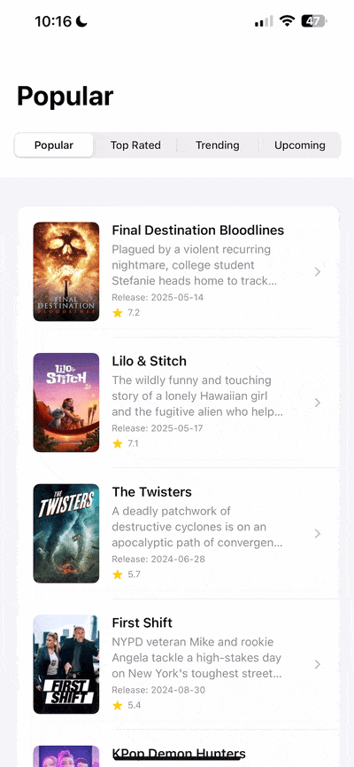

# CineMate

**CineMate** is a SwiftUI iOS app for browsing, filtering, and saving movies powered by The Movie Database (**TMDB**) API.  
It emphasizes clean architecture, fast UI iteration (Previews + mocks), and safe persistence via Firebase **Anonymous Auth** + **Firestore**.

**Key highlights**
- MVVM with init-based dependency injection
- Enum-driven navigation (`AppRoute` / `AppNavigator`) with push/replace semantics
- Region-aware content & streaming availability
- Search with debounce, pagination, in-flight guards and caching
- Previews + mocks for offline UI development
- Secure API key management with sanitized history

> **Recommended setup:** Xcode **15.3+** and iOS **17.4** (deployment targets include 17.4 and 18.5)  
> **Quick start:** clone → copy `Secrets.example.plist` to `Secrets.plist` → add TMDB keys → add `GoogleService-Info.plist` → Run

---

## Features
- Browse popular/top-rated movies and open details with credits & recommendations
- Search with debounce + infinite scroll
- Save/remove favorites for **movies** and **people** (actors/directors) with real-time updates
- Region-specific watch providers

---

## Prerequisites

You need the following local configuration files before running the app:

| File | Location | Purpose |
|------|----------|---------|
| `Secrets.plist` | `CineMate/Secrets.plist` | TMDB API keys and tokens |
| `GoogleService-Info.plist` | `CineMate/GoogleService-Info.plist` | Firebase config for Anonymous Auth + Firestore |

> These are **excluded from version control**. Use `Secrets.example.plist` as a template.

---

## Secrets & Security

The sensitive files below are ignored in Git and enforced via repository config (`.gitignore`, `.github/CODEOWNERS`):

- `Secrets.plist`  
- `GoogleService-Info.plist`

> **Historic note:** `Secrets.plist` was unintentionally committed early in development. In **June 2025** the Git history was rewritten/sanitized using `git-filter-repo` to purge any leaked secrets. Only `Secrets.example.plist` remains in history for safe reference.

---

## Project Setup (Xcode)

1. Open the project in **Xcode 15.3** or later.  
2. Add your `Secrets.plist`:
   - Right-click **CineMate** → **New File… → Property List**  
   - Name it `Secrets.plist`  
   - Add keys (example):
     ```xml
     <?xml version="1.0" encoding="UTF-8"?>
     <plist version="1.0">
     <dict>
       <key>TMDB_API_KEY</key>
       <string>PUT-YOUR-API-KEY-HERE</string>
       <key>TMDB_BEARER_TOKEN</key>
       <string>PUT-YOUR-BEARER-TOKEN-HERE</string>
     </dict>
     </plist>
     ```
3. Add `GoogleService-Info.plist` from **Firebase Console** (create iOS app).  
4. In **Firebase Console**:
   - Enable **Authentication → Anonymous**
   - Enable **Firestore** and publish rules (see **Firebase Overview** below)
5. Select device/simulator (iOS 17.4+) and run (Cmd+R).

---

## Architecture & Design

- **MVVM** with focused ViewModels driving SwiftUI views.  
- **Init-based dependency injection** for testability and simplicity.  
- **Repository pattern** abstracts the TMDB service layer and enables mocking.  
- **Enum-driven navigation** (`AppRoute` / `AppNavigator`) with push/replace semantics for deterministic routing and programmatic control.  
- **Preview-first**: `PreviewFactory`, shared mock data, and `ProcessInfo.processInfo.isPreview` guard for network-free previews.  
- **Caching & in-flight guards** to prevent duplicates, reduce UI flicker, and improve perceived performance.  
- **Pagination / Infinite scroll** with explicit state (current page, total pages, loading guard).  
- **Region-awareness** using `Locale.current.region?.identifier` for localized content and streaming providers.  

---

## Caching & Performance

- **In-flight guards:** prevent duplicate requests per movie (`Set<Int>` + Task cancellation).
- **PaginationManager:** safe infinite scroll; no overlapping next‑page fetches.
- **Preview bypass:** `ProcessInfo.isPreview` skips network calls in SwiftUI Previews.
- **Lightweight caches:** reuse previous results where it makes sense.
- **Less UI flicker:** preserve state between views and inject quick “stubs”.

**Example (shortened):**
```swift
// Duplicate protection for detail fetch
guard !detailInFlight.contains(movieId) else { return }
detailInFlight.insert(movieId)
defer { detailInFlight.remove(movieId) }

// Pagination guard
guard pagination.startFetchingNextPage() else { return }

// Previews: avoid real network work
guard !ProcessInfo.processInfo.isPreview else { return }
```

---

## Navigation

Centralized, enum-based navigation using `AppRoute` and `AppNavigator`.  
Supports:
- Push and replace semantics  
- Decoupled programmatic flows  
- Deterministic behavior useful in testing  

Example:
```swift
navigator.goTo(.movieDetail(id: movie.id), replace: false)
```

---

## Previews & Mocks

- `PreviewFactory` supplies ViewModels in different UI states (loading, error, empty, populated).  
- `MockMovieRepository` and shared preview data enable offline rendering.  
- Helpers like `.withPreviewNavigation()` simulate realistic navigation context in canvas.

---

## Running the App

1. Open project in **Xcode 15.3**  
2. Select **iOS 17.4** simulator or device  
3. Press **Cmd+R**

---

## Feature Demos

> **Watch CineMate in Action**  
> [Click here to view full demo on Vimeo »](https://vimeo.com/1098629918)

### Popular Movie List  
Scrollable list of popular movies with smooth loading and preview.


### Genre Filtering  
Toggle between genres with instant feedback, cancellation, and in-memory caching.


### Movie Detail + Share  
View trailers, details and share movie info seamlessly.


### List Scroll & Infinite Loading  
Smooth infinite scroll and pagination for search and long collections.



---

## Region-Based Streaming Support

CineMate detects the user's **current country** and adjusts:

- **Movie content** (Popular, Top Rated, Trending, Upcoming) per region (🇸🇪 Sweden, 🇮🇳 India, 🇨🇱 Chile, etc.)  
- **Streaming providers** (Netflix, HBO Max, Apple TV, etc.) available specifically for that region  

Handled automatically via:
```swift
Locale.current.region?.identifier ?? "US"
```

> Content is localized without user configuration.  

---

## Debug & Limitations

- **Simulator caveat:** `Locale.current.region` in Simulator follows macOS settings; real device gives more accurate region-based results.  
- **Streaming deep links:** Most provider links are web URLs; direct app opening is not guaranteed. TMDB does not expose custom deep link schemes like `netflix://` in a reliable way.  
- **Firebase / Google Sign-In:** Planned but not fully integrated yet.

---

## Firebase Overview

**Data model (Firestore)**
```
users/{uid}/favorites/{movieId}
users/{uid}/favorite_people/{personId}
```

**Rules (summary)**  
Each user may only read/write their own `/users/{uid}/…` subtree. Configure in **Firebase Console → Firestore → Rules**.

**Privacy**  
No email is collected; favorites are keyed by anonymous `uid` only.

---

## Roadmap

- **Email & Google sign-in** (Firebase Auth)
- Persistent on-device cache for offline
- Basic telemetry for latency/cache metrics

---

## External Resources

- [TMDB – The Movie Database](https://www.themoviedb.org/)  
- [Firebase](https://firebase.google.com/)

---

## Portfolio

Demonstrates:
- Real-world async API integration with TMDB  
- Secure secret management and history sanitization  
- Enum-based deterministic navigation  
- State-driven SwiftUI with caching, debounce, pagination, and in-flight guards  
- Preview-first development for fast iteration  

> Star the repo if you find it useful or inspiring.

---

## Folder Structure

```
CineMate/
├── CineMateApp.swift
├── Info.plist
├── Core/
│   ├── Config/
│   ├── Models/
│   ├── Networking/
│   ├── Repository/
│   └── Utilities/
├── Features/
│   ├── Discover/
│   ├── SeeAllMovies/
│   ├── Search/
│   ├── Favorites/
│   ├── Account/
│   └── Genre/
├── UI/
│   └── Components/
├── Previews/
│   ├── Mocks/
│   ├── Factory/
│   └── Data/
├── Resources/
│   ├── Assets.xcassets/
│   └── Secrets/
└── README.md
```

---

## LIA / Contact
I’m seeking a **LIA (internship)**. Open to remote/hybrid — based in **Stockholm (Haninge)**.  
**LinkedIn:** https://www.linkedin.com/in/nicholas-samuelsson-jeria-69778391

---

Enjoy exploring CineMate

> *“Do. Or do not. There is no try.”*  
> — Yoda
