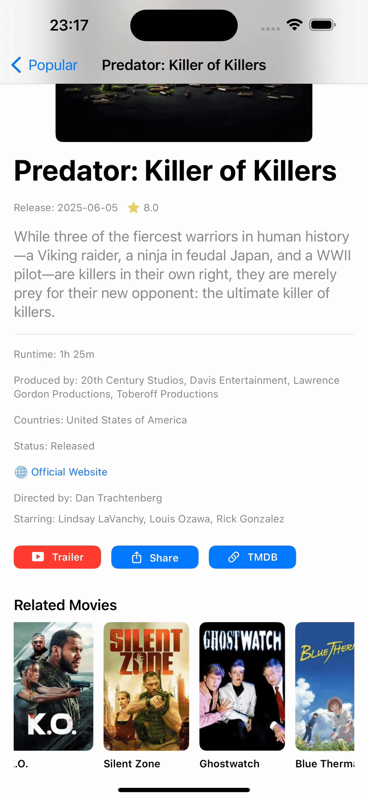

# CineMate

**CineMate** is a SwiftUI-based iOS app that lets users browse, filter, and save movies using The Movie Database (**TMDB**) API.  
**Planned support for Google Sign-In via Firebase Authentication.**  
It uses **MVVM** architecture and follows clean development practices.

> **Recommended setup:** Xcode **15.3** + iOS **17.4** (simulator or real device)

---

## Prerequisites

Before running the app, you need two local configuration files:

| File | Location | Purpose |
|------|----------|---------|
| `Secrets.plist` | `CineMate/Secrets.plist` | Stores your TMDB API keys |
| `GoogleService-Info.plist` | `CineMate/GoogleService-Info.plist` | Firebase configuration for Google Sign-In *(planned)* |

> These files are **ignored in Git** to protect your secrets. Use the provided `Secrets.example.plist` as a reference.

---

## 🔐 Secrets & Security

These files are listed in `.gitignore` and protected by `.github/CODEOWNERS`:

- `Secrets.plist`
- `GoogleService-Info.plist` *(planned use with Firebase)*

This ensures sensitive data is never committed to GitHub, even by mistake.

---

## Project Setup (Xcode)

### 1 — Add `Secrets.plist`

1. Open project in **Xcode 15.3**
2. In **CineMate** folder → right-click → **New File… → Property List**
3. Name it `Secrets.plist`
4. Open as **Source Code** and paste:

```xml
<?xml version="1.0" encoding="UTF-8"?>
<plist version="1.0">
<dict>
    <key>TMDB_API_KEY</key>
    <string>PUT-YOUR-API-KEY-HERE</string>
    <key>TMDB_BEARER_TOKEN</key>
    <string>PUT-YOUR-BEARER-TOKEN-HERE</string>
</dict>
</plist>
```

### 2 — Add `GoogleService-Info.plist` *(optional for now)*

1. Go to **Firebase Console → Project Settings → General → Your Apps**
2. Download the `GoogleService-Info.plist`
3. Drag it into your **CineMate** folder in Xcode
4. Tick **"Copy if needed"**

---

## Architecture & Concepts

- MVVM (Model–View–ViewModel)
- Google Sign-In with Firebase *(planned)*
- `Secrets.plist` used for secure API access
- Dependency Injection (used for ViewModels and Repositories)
- Generic service layer for TMDB endpoints
- `.gitignore` and `.github/CODEOWNERS` used for professional repo hygiene

---

## Running the App

1. Select a simulator running iOS 17.4 (e.g. iPhone 15)
2. Press **Cmd + R** or click ▶️ to build & run

---

## Feature Preview

Here are two short demos of CineMate in action:

### Movie Detail View
This demo shows how users can explore a specific movie, watch the trailer, view cast members, and use the Share feature.



---

### Movie List View
This demo shows the main screen where users can browse trending movies and access quick details.


## External Resources

- [TMDB – The Movie Database](https://www.themoviedb.org/)
- [Firebase](https://firebase.google.com/)

---

## Portfolio Notes

This app is part of my iOS development portfolio. It demonstrates:

- Real-world API handling (TMDB)
- Secure API key management
- UI/UX considerations with empty state views and genre filtering
- Professional GitHub setup (CODEOWNERS, branch protection, secrets ignored)
- Consideration for advanced patterns like Dependency Injection, SRP, and SoC
- ⭐️ If you find CineMate useful or inspiring, feel free to leave a star on GitHub — every bit of support is appreciated.

> This project is still evolving — new features and improvements are added continuously.

> Want to learn more or collaborate?  
**Connect on LinkedIn:** [nicholas-samuelsson-jeria](https://www.linkedin.com/in/nicholas-samuelsson-jeria-69778391)

---

## Folder Structure (WIP)

```
CineMate
├── Features
│   ├── MovieList
│   ├── MovieDetail
├── Services
├── Models
├── ViewModels
├── Secrets.example.plist
├── .github
│   └── CODEOWNERS
├── .gitignore
└── README.md
```

---

## 🔐 Google Sign-In Overview *(planned)*

> Support for Firebase Authentication is in progress.  
> Below is a code example showing how sign-in will work:

```swift
let credential = GoogleAuthProvider.credential(
    withIDToken: idToken,
    accessToken: accessToken
)
Auth.auth().signIn(with: credential) { result, error in
    // Signed in to Firebase
}
```

---

Enjoy exploring CineMate

> *“Do. Or do not. There is no try.”*  
> — Yoda
