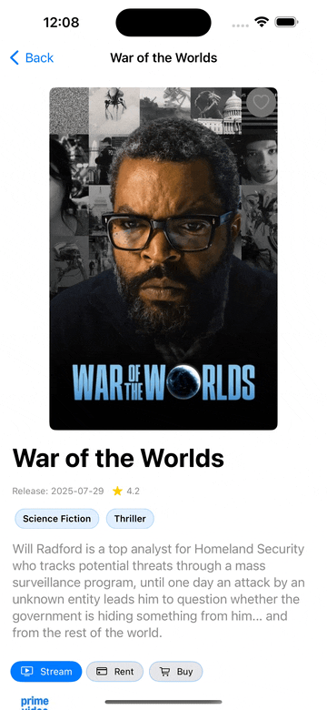

# CineMate

**CineMate** is a SwiftUI iOS app for browsing, filtering, and saving movies powered by The Movie Database (**TMDB**) API.  
It emphasizes clean architecture, fast UI iteration (Previews + mocks), and safe persistence via Firebase **Auth** + **Firestore**.

> **Authentication included:** Email/Password, password reset, **Google Sign‑In (Firebase)**, and Anonymous guest mode. Reusable auth UI components and validators are included.

> **Recommended setup:** Xcode **15.3+** and iOS **17.4** (deployment targets include 17.4 and 18.5)  
> **Quick start:** clone -> copy `Secrets.example.plist` to `Secrets.plist` -> add TMDB keys -> add `GoogleService-Info.plist` -> Run

---

## Feature Demos

> **Watch CineMate in Action** — [Full demo on Vimeo »](https://vimeo.com/1110514808)

| Browse → Detail | Real-time Favorites | Search + Infinite Scroll |
|---|---|---|
|  |  |  |

---

## Features

### Movies
- Browse popular/top‑rated movies; details include credits & recommendations
- Search with debounce + infinite scroll
- Save/remove favorites for **movies** and **people** with real‑time updates
- Region‑specific watch providers

### Authentication (Firebase)
- **Create Account** (Email/Password) — sends **verification email** on signup
- **Sign In** (Email/Password) — UI offers **Resend verification** if needed
- **Forgot Password** — email reset link
- **Anonymous (Guest)** — one‑tap; can later **link** to email/password
- **Google Sign‑In** — official Google SwiftUI button + Firebase credential exchange
- **Sign Out** — from Account tab

**UI building blocks**
- `RoundedField` + `TrailingIcon` (clear/eye actions)
- `AuthEmailField`, `AuthPasswordField` (sanitization, submit/clear, reveal, optional focus)
- `AuthErrorBlock` (message + optional “Resend verification”)
- `ValidationMessageView`
- `ToastCenter` (transient feedback)
- `View+Focus.applyFocus(_:)` (only applies `.focused` if a binding is provided)

**Validation & errors**
- `AuthValidator` — trims whitespace, lowercases email; pragmatic email regex; password policy (min/max length, requires lower/upper/digit)
- `AuthAppError` — maps Firebase/Google errors → compact, user‑friendly cases

---

## Prerequisites

You need the following local configuration files before running the app:

| File | Location | Purpose |
|------|----------|---------|
| `Secrets.plist` | `CineMate/Secrets.plist` | TMDB API keys and tokens |
| `GoogleService-Info.plist` | Add to the Xcode project (app target) | Firebase config for Auth + Firestore + Google client ID |

> These are **excluded from version control**. Use `Secrets.example.plist` as a template.

### Firebase Console configuration
- **Authentication → Sign‑in method**
- Enable **Anonymous**
- Enable **Email/Password**
- Enable **Google**
- **Firestore**
- Create database
- Publish security rules (see **Firebase Overview** below)

---

## Google Sign‑In (Quick Setup)

1) **Add packages (SPM):**  
- `GoogleSignIn`  
- `GoogleSignInSwift` (official SwiftUI button)

2) **Info.plist:**  
- **URL Types** → add your `REVERSED_CLIENT_ID` (found in `GoogleService-Info.plist`).  
- (Optional) **LSApplicationQueriesSchemes** → include `google` if you plan to check `canOpenURL` for Google apps.

3) **Bootstrap at launch:**  
Call these once inside `CineMate.init()`:
```swift
FirebaseBootstrap.ensureConfigured()
GoogleSignInBootstrap.ensureConfigured()
```

4) **Handle the OAuth redirect:**  
Add to the root view (e.g., in `CineMateApp` body):
```swift
.handleGoogleSignInURL()
```

5) **Use the official SwiftUI button:**  
```swift
import GoogleSignInSwift

GoogleSignInButton(
scheme: colorScheme == .dark ? .dark : .light,
style: .standard, // .standard, .wide, .icon
state: viewModel.isAuthenticating ? .disabled : .normal
) {
Task { await viewModel.signInWithGoogle() }
}
.frame(height: 48)
.frame(maxWidth: .infinity)
```

6) **Exchange tokens with Firebase:**  
The sign-in flow returns `idToken` + `accessToken` which are exchanged for a Firebase credential:
```swift
let credential = GoogleAuthProvider.credential(
withIDToken: tokens.idToken,
accessToken: tokens.accessToken
)
let result = try await Auth.auth().signIn(with: credential)
```

> **Previews:** All Google/Firebase code paths are guarded by `ProcessInfo.processInfo.isPreview` so Xcode Previews stay offline.

---

## Project Setup (Xcode)

1. Open the project in **Xcode 15.3** or later.  
2. Add your `Secrets.plist`:
- Right‑click **CineMate** → **New File… → Property List**
- Name it `Secrets.plist`
- Add keys (example):
```xml
<?xml version="1.0" encoding="UTF-8"?>
<plist version="1.0">
<dict>
<key>TMDB_API_KEY</key>
<string>PUT-YOUR-API-KEY-HERE</string>
<key>TMDB_BEARER_TOKEN</key>
<string>PUT-YOUR-BEARER-TOKEN-HERE</string>
</dict>
</plist>
```
3. Add `GoogleService-Info.plist` from **Firebase Console** (create iOS app) and **add it to the app target** in Xcode (Target Membership / Build Phases → Copy Bundle Resources).  
4. In **Firebase Console**: enable **Anonymous**, **Email/Password**, **Google** sign‑in; enable **Firestore**, publish rules.  
5. Select device/simulator (iOS 17.4+) and run (Cmd+R).

---

## Architecture & Design

- **MVVM** with focused ViewModels driving SwiftUI views  
- **Init‑based dependency injection** for testability and simplicity  
- **Repository pattern** abstracts the TMDB service layer and enables mocking  
- **Enum‑driven navigation** (`AppRoute` / `AppNavigator`) with push/replace semantics  
- **Preview‑first**: `PreviewFactory`, shared mock data, and `ProcessInfo.isPreview` guards  
- **Caching & in‑flight guards** to prevent duplicates and reduce UI flicker  
- **Pagination / Infinite scroll** with explicit state  
- **Region‑awareness** using `Locale.current.region?.identifier`  

---

## Previews & Mocks

- `PreviewFactory` supplies view models in different states (loading/error/empty/populated).
- Helpers:
  - `.withPreviewNavigation()` — injects `AppNavigator` in a `NavigationStack`
  - `.withPreviewToasts()` — injects `ToastCenter`
- UI components render offline without live services.

---

## Caching & Performance (highlights)

- **In‑flight guards:** prevent duplicate requests per movie (`Set<Int>` + Task cancellation)
- **Pagination guard:** prevents overlapping next‑page fetches
- **Preview bypass:** `ProcessInfo.isPreview` skips network calls in SwiftUI Previews
- **Lightweight caches:** reuse previous results where it makes sense

**Example (shortened):**
```swift
// Duplicate protection for detail fetch
guard !detailInFlight.contains(movieId) else { return }
detailInFlight.insert(movieId)
defer { detailInFlight.remove(movieId) }

// Pagination guard
guard pagination.startFetchingNextPage() else { return }

// Previews: avoid real network work
guard !ProcessInfo.processInfo.isPreview else { return }
```

---

## Navigation

Centralized, enum‑based navigation using `AppRoute` and `AppNavigator`.  
Supports push/replace, decoupled programmatic flows, and deterministic behavior for testing.

```swift
navigator.goTo(.movieDetail(id: movie.id), replace: false)
```

---

## Region‑Based Streaming Support

CineMate detects the user’s **current country** and adjusts:

- **Movie content** (Popular, Top Rated, Trending, Upcoming) per region (🇸🇪 🇮🇳 🇨🇱, etc.)  
- **Streaming providers** (Netflix, HBO Max, Apple TV, etc.) available in that region

Handled automatically via:
```swift
Locale.current.region?.identifier ?? "US"
```

---

## Firebase Overview

**Firestore data model (simplified)**
```
users/{uid}/favorites/{movieId}
users/{uid}/favorite_people/{personId}
```

**Rules (summary)**  
Each user may only read/write their own `/users/{uid}/…` subtree. Configure in **Firebase Console → Firestore → Rules**.

**Privacy**  
Anonymous mode stores favorites keyed only by a generated `uid`. Email is only collected when the user opts in to register/sign‑in.

---

## Running the App

1. Open project in **Xcode 15.3**  
2. Select **iOS 17.4** simulator or device  
3. Press **Cmd+R**

---

## Folder Structure

```
CineMate/
├── CineMateApp.swift
├── Info.plist
├── Core/
│   ├── Config/
│   ├── Models/
│   ├── Networking/
│   ├── Repository/
│   └── Utilities/
├── Features/
│   ├── Discover/
│   ├── SeeAllMovies/
│   ├── Search/
│   ├── Favorites/
│   ├── Account/
│   │   └── Auth/
│   │       ├── Views/
│   │       │   ├── LoginView.swift
│   │       │   ├── CreateAccountView.swift
│   │       │   └── ResetPasswordSheet.swift
│   │       ├── ViewModels/
│   │       │   ├── LoginViewModel.swift
│   │       │   ├── CreateAccountViewModel.swift
│   │       │   └── ResetPasswordViewModel.swift
│   │       └── Components/
│   │           ├── AuthEmailField.swift
│   │           ├── AuthPasswordField.swift
│   │           ├── AuthErrorBlock.swift
│   │           └── ValidationMessageView.swift
│   └── Genre/
├── UI/
│   ├── Components/
│   │   ├── RoundedField.swift
│   │   └── TrailingIcon.swift
│   └── Common/
│       └── Extensions/
│           └── View+Focus.swift
├── Previews/
│   ├── Factory/
│   ├── Data/
│   └── Mocks/
├── Resources/
│   ├── Assets.xcassets/
│   ├── Assets/
│   │   ├── popular_to_detail.gif
│   │   ├── favorites_realtime.gif
│   │   └── search_infinite_scroll.gif
│   └── Secrets/
│       └── Secrets.example.plist
└── README.md
```

---

## Roadmap

- Profile management (change email / password)

---

## External Resources

- [TMDB – The Movie Database](https://www.themoviedb.org/)  
- [Firebase](https://firebase.google.com/)  
- [Google Sign-In for iOS](https://developers.google.com/identity/sign-in/ios)  
- [GoogleSignInSwift (SwiftUI button)](https://github.com/google/GoogleSignIn-iOS)

---

## Portfolio / Contact

I’m seeking a **LIA (internship)**. Open to remote/hybrid — based in **Stockholm (Haninge)**.  
**LinkedIn:** https://www.linkedin.com/in/nicholas-samuelsson-jeria-69778391

---

Enjoy exploring **CineMate**

> *“Do. Or do not. There is no try.”* — Yoda
