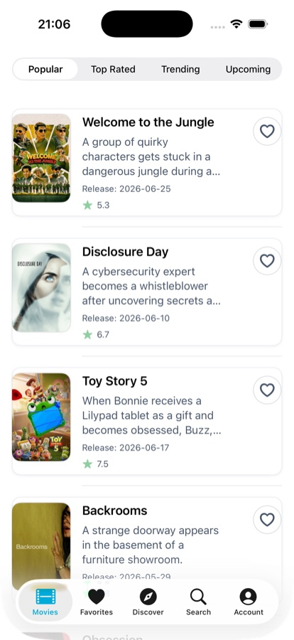
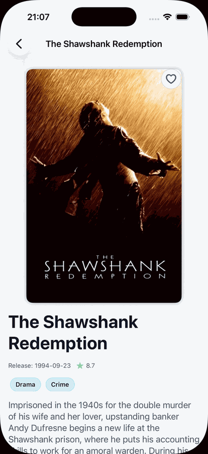
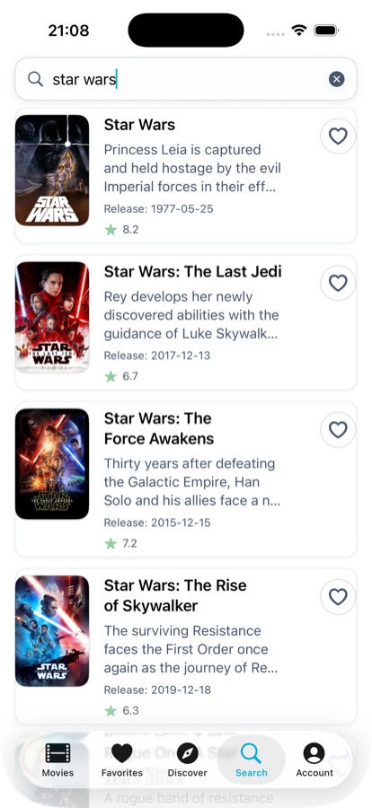
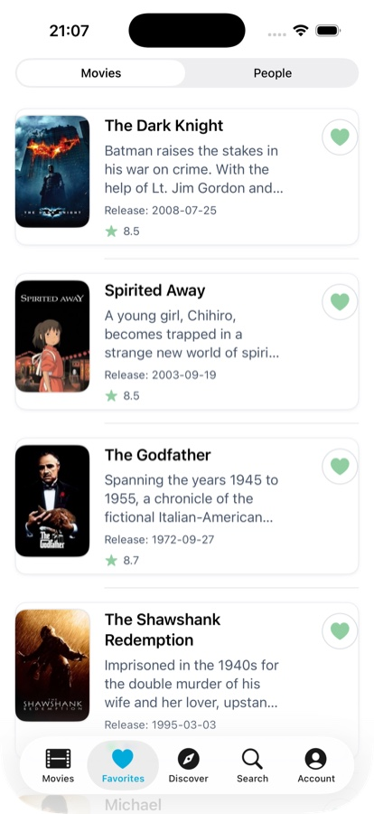
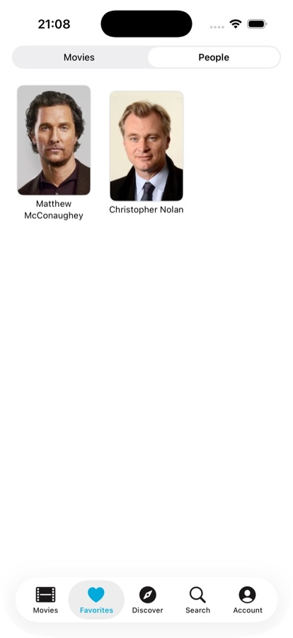

# CineMate

CineMate is a SwiftUI iOS app for browsing, discovering, and saving movies with data from TMDB. It combines a polished movie discovery experience with Firebase-backed authentication, real-time favorites, account controls, and Firestore security rules.

The project is built to show production-oriented iOS fundamentals: clear feature boundaries, dependency injection, previewable SwiftUI screens, async networking, Firebase integration, and focused tests around validation and access rules.

## Demo

| Movie Lists | Movie Detail | Search |
|---|---|---|
|  |  |  |

| Favorite Movies | Favorite People |
|---|---|
|  |  |

## Highlights

- SwiftUI app with tab-based navigation, typed routes, and shared navigation state.
- TMDB-powered movie lists, detail pages, cast, crew, trailers, recommendations, genres, watch providers, and people pages.
- Firebase Auth with email/password, Google Sign-In, anonymous guest mode, email verification, password reset, and account deletion.
- Firestore-backed favorite movies and favorite people with real-time listeners.
- Guest gating for protected discovery/search workflows with an upgrade path.
- Legal acceptance flow for terms and privacy versions, enforced by Firestore rules.
- Preview-first UI structure with reusable mock data and preview factories.
- Focused XCTest coverage for search/auth validation and mapping behavior.
- Firebase emulator tests for Firestore access rules.

## Tech Stack

| Area | Tools |
|---|---|
| App | Swift, SwiftUI, MVVM, async/await |
| Data | TMDB API, URLSession, Codable |
| Auth | Firebase Auth, Google Sign-In |
| Persistence | Cloud Firestore |
| Testing | XCTest, Firebase Emulator Suite, Node test runner |
| Tooling | Xcode project, Swift Package Manager, secret-scan script |

## Project Structure

```text
.
├── Assets/                           # Existing demo media
├── CineMate/                         # iOS app project
│   ├── CineMate/                     # App source
│   │   ├── Core/                     # Networking, Firebase, config, models, navigation
│   │   ├── Design/                   # Shared app styling
│   │   └── Features/                 # Feature modules and shared UI components
│   ├── CineMate.xcodeproj/           # Xcode project and shared scheme
│   ├── CineMateTests/                # XCTest target
│   ├── Docs/Media/                   # Optimized README screenshots and GIF
│   ├── functions/                    # Firestore rules test harness
│   ├── firestore.rules               # Firestore security rules
│   └── firebase.json                 # Firebase config
├── scripts/                          # Repository checks
└── README.md                         # This file
```

## Setup

### Requirements

- Xcode with Swift Package Manager support.
- iOS 17.6+ simulator or device.
- Firebase project with Authentication and Firestore enabled.
- TMDB API credentials.
- Node.js and Firebase CLI for Firestore rules tests.

### 1. TMDB Secrets

Create the local secrets plist used by the app target:

```sh
cp CineMate/CineMate/Secrets.example.plist CineMate/CineMate/Features/Resources/Secrets.plist
```

Then fill in:

- `TMDB_API_KEY`
- `TMDB_BEARER_TOKEN`

`Secrets.plist` is ignored by Git and should never be committed.

### 2. Firebase + Google Sign-In

Download `GoogleService-Info.plist` from Firebase Console and place it at:

```text
CineMate/CineMate/Core/Config/GoogleService-Info.plist
```

In Firebase Console, enable these sign-in providers:

- Anonymous
- Email/Password
- Google

Also verify that the URL scheme in `CineMate/CineMate/Info.plist` matches the `REVERSED_CLIENT_ID` from `GoogleService-Info.plist`.

More Firebase setup notes live in [`CineMate/CineMate.xcodeproj/FirebaseConfig-README.md`](CineMate/CineMate.xcodeproj/FirebaseConfig-README.md).

### 3. Run the App

Open the Xcode project:

```sh
open CineMate/CineMate.xcodeproj
```

Select the shared `CineMate` scheme, choose an iOS simulator or device, and run.

## Verification

Run app tests from the repo root:

```sh
xcodebuild test \
  -project CineMate/CineMate.xcodeproj \
  -scheme CineMate \
  -destination 'platform=iOS Simulator,name=iPhone 16'
```

Run Firestore rules tests:

```sh
cd CineMate/functions
npm install
npm run test:rules
```

Run the repository secret guard:

```sh
scripts/check-secrets.sh --all
```

## Architecture

CineMate uses a lightweight MVVM structure with dependencies assembled at the app root. Shared services are created once, injected into long-lived view models, and reused across tab flows.

Key patterns:

- `CineMateApp.swift` owns bootstrap, dependency creation, auth gating, and shared environment objects.
- `MovieRepository` wraps `TMDBService` behind `MovieProtocol` for production code and previews/tests.
- `AppRoute` and `AppNavigator` provide typed navigation through a shared `NavigationStack`.
- Firebase bootstrap is guarded so previews do not accidentally configure production SDKs.
- Feature folders keep screens, view models, components, preview data, and mocks close to their domain.
- Firestore rules enforce that protected writes require current terms/privacy acceptance.

Useful entry points:

- [`CineMate/CineMate/CineMateApp.swift`](CineMate/CineMate/CineMateApp.swift)
- [`CineMate/CineMate/Core/Networking/TMDBService.swift`](CineMate/CineMate/Core/Networking/TMDBService.swift)
- [`CineMate/CineMate/Core/Repository/MovieRepository.swift`](CineMate/CineMate/Core/Repository/MovieRepository.swift)
- [`CineMate/CineMate/Core/Navigation/AppNavigator.swift`](CineMate/CineMate/Core/Navigation/AppNavigator.swift)
- [`CineMate/CineMate/Core/Firebase/Auth/Services/FirebaseAuthService.swift`](CineMate/CineMate/Core/Firebase/Auth/Services/FirebaseAuthService.swift)
- [`CineMate/CineMate/Core/Firebase/Firestore/FirestoreFavoritesRepository.swift`](CineMate/CineMate/Core/Firebase/Firestore/FirestoreFavoritesRepository.swift)
- [`CineMate/functions/README.md`](CineMate/functions/README.md)

## Firestore Rules and Legal Versions

Firestore writes under protected user data require current legal acceptance metadata:

- `termsVersion`
- `privacyVersion`
- `acceptedAt`

When terms or privacy copy changes, keep these files in sync:

- [`CineMate/CineMate/Core/Firebase/Auth/Validation/TermsContent.swift`](CineMate/CineMate/Core/Firebase/Auth/Validation/TermsContent.swift)
- [`CineMate/firestore.rules`](CineMate/firestore.rules)
- [`CineMate/functions/src/rules/firestore.rules.test.ts`](CineMate/functions/src/rules/firestore.rules.test.ts)

Then run:

```sh
cd CineMate/functions
npm run test:rules
```

## Security Notes

The repo includes a local and CI secret scan for common accidental leaks:

- Firebase plist files
- TMDB secrets
- environment files
- private keys and provisioning files
- common API token formats

The GitHub workflow runs `scripts/check-secrets.sh --all` on pushes and pull requests.

## TMDB Attribution

This product uses the TMDB API but is not endorsed or certified by TMDB.

- TMDB API is used for movie metadata, people data, images, trailers, recommendations, and watch-provider availability.
- TMDB attribution and API usage must follow TMDB's terms and branding guidance.

Links:

- [TMDB Developer FAQ](https://developer.themoviedb.org/docs/faq)
- [TMDB API Terms of Use](https://www.themoviedb.org/api-terms-of-use?language=en-US)
- [TMDB Terms of Use](https://www.themoviedb.org/terms-of-use)
